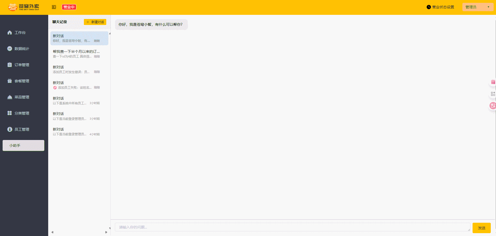

# 苍穹外卖 - AI智能增强版

## 项目结构

```
.
├── sky-take-out/      # 后端项目 (Spring Boot 3)
└── project-sky-admin-vue-ts/     # 前端项目 (Vue)
```

> **快速导航:**
>
> - **[进入后端项目](sky-take-out)**
> - **[进入前端项目](project-sky-admin-vue-ts)**

## 1. 项目概述

本项目基于B站知名的“苍穹外卖”Java后端项目进行构建，完整实现了传统外卖业务所需的核心功能，包括用户端、管理端的商品、订单、购物车、地址管理等全套业务流程。

与市面上其他“苍穹外卖”项目最大的不同在于，我深度结合了自身在**人工智能与深度学习领域的专业背景**，通过集成 `LangChain4j`框架，为项目**注入了先进的AI能力**，打造了一个具备核心竞争力的“**AI智能增强版**”苍穹外卖。

这不仅是一个简单的Java业务项目，更是一个**Java后端与前沿AI技术融合的创新实践**。（注：AI可以实现的后台功能我并未所有都加上，本质上了解了后台的AI调用，其他也都会了）

---

## 2. 核心创新点：AI智能助手

我为后台管理系统引入了一个**AI智能助手聊天窗口**，它彻底改变了传统后台的交互方式，将复杂的后台操作变成了与AI对话的简单过程。

### 演示效果

<p align="center">
  <!-- 在这里替换成你的GIF链接或者直接上传图片 -->
  
</p>

### 实现亮点

1. **自然语言驱动的后台管理**：管理员不再需要点击繁琐的菜单和按钮，可以直接通过自然语言向AI助手下达指令。例如：

   * “帮我查一下今天有多少订单？”
   * “给我看一下ID为1的员工详细信息。”
   * “今天从上午10点到下午3点的营业额是多少？”
2. **RAG私有知识库增强**：除了执行业务操作，AI助手还能回答关于项目本身或者公司内部规定的问题。我通过**检索增强生成（RAG）**技术，将位于项目 `/resources/knowledge`目录下的私有文档（如：员工手册、技术文档、常见问题解答等）加载并向量化。当用户提问时，系统会先从这些文档中检索最相关的信息，再结合大模型的生成能力，给出精准、基于事实的回答。
3. **上下文感知的多轮对话**：AI助手能够理解对话的上下文。在查询完员工列表后，可以直接追问“那第二个员工是谁？”，AI能够准确理解并执行。
4. **智能工具调用 (Function Calling)**：这是整个AI助手的技术核心。我将后台的Service层方法封装成了可供大模型调用的**“工具”**（Tools）。当AI理解用户意图后，它能**自动选择并调用**对应的Java方法（如 `getOrderSummary`, `getEmployeeById`等），并将查询结果以自然语言的形式反馈给用户。
5. **流式响应 (Streaming)**：为了提升用户体验，AI的回复采用了流式输出，文字会像打字机一样逐字显示，避免了长时间的等待。

### 技术挑战与解决方案

在将AI集成进传统的Spring Boot项目时，我遇到了并成功解决了一些关键的技术挑战：

* **`ThreadLocal`上下文丢失问题**：`LangChain4j`的异步特性会导致其在独立的线程中执行工具调用，无法访问到主请求线程中存储的用户登录信息(`ThreadLocal`)。

  * **我的解决方案**：通过在发起AI请求时，**动态地将当前管理员ID作为上下文信息注入到Prompt中**，并重构工具（Tools）的调用方式，让大模型从上下文中解析ID并作为参数传入，从而完美解耦了AI执行逻辑与Web线程上下文的绑定。
* **同步阻塞与异步流式处理的融合**：将后端同步的Service方法调用，与前端要求的异步流式聊天体验相结合。

  * **我的解决方案**：利用 `Project Reactor`的 `Flux`响应式编程模型，将后端数据处理与流式输出解耦，实现了流畅的打字机效果。

---

## 3. 项目原始功能

除了AI创新点外，项目保留并优化了原版“苍穹外卖”的所有核心功能。

### 管理端

- 员工管理
- 分类管理
- 菜品管理
- 套餐管理
- 订单管理
- 工作台数据统计

### 用户端

- 微信授权登录
- 浏览商品、菜品
- 购物车操作
- 地址管理
- 下单与支付
- 历史订单查看

---

## 4. 技术栈

* **后端核心**: Spring Boot 3, Spring MVC, MyBatis, Spring Task
* **AI集成**: LangChain4j, DashScope (通义千问模型)
* **数据库**: MySQL 8, Druid
* **缓存**: Redis (已集成，可按需开启)
* **API文档**: Knife4j
* **响应式编程**: Project Reactor

## 5. 准备工作

* 安装mysql
* 安装redis
* 安装mongodb
* 配置微信小程序，网址[微信公众平台](https://mp.weixin.qq.com/)
* 配置阿里云OSS对象存储，网址[阿里云](https://www.aliyun.com/product/oss)
* 配置阿里百炼平台大模型，网址[阿里百炼](https://bailian.console.aliyun.com/?tab=model#/model-market)
* 配置pinecone向量数据库，网址[Pinecone](https://app.pinecone.io/organizations/)

## 6. 一些保留给自己的

启动redis，默认端口号6379

```powershell
redis-server.exe redis.windows.conf
```

mongodb默认端口号27017

## 整体项目知识库比较浅显，本人所学java知识也只是皮毛，包括前端也只停留在似懂非懂层面，各位大神前辈发现问题可以及时交流，也请不吝赐教，晚辈在这里先道一声谢啦。
